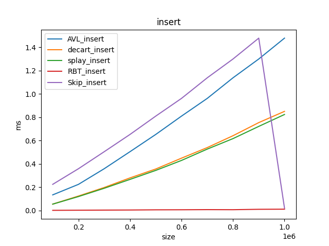
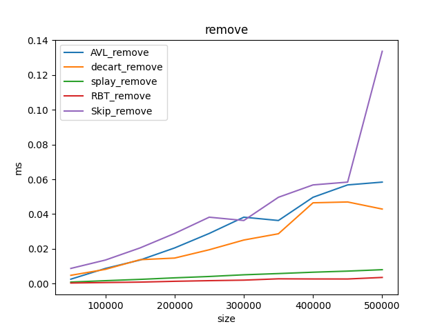

# Лабораторная 5. Сравнение Деревьев Поиска

В данной лабораторной работе
мы сравнивали эффективность различных деревьев поиска

## Графики

Для генерации данных Пункта 2.1 следует запустить

    cmake с target = lab_hash

Это запустит тесты и положит их результаты в директорию data

Для генерации данных Пункта 2.3 и 2.3 следует запустить

    cmake с target = lab_hash

Это запустит тесты и lab_hash_ran dom их результаты в директорию data

Для генерации данных Пункта 3 следует запустить

    cmake с target = lab_hash_find

Это запустит тесты и положит их результаты в директорию data

При построении графиков использовался скрипт `graph_ctor.py`. Запустить:

    cmake с target = gen_graph
Это сгенерирует графики из данныз в диретории data и сохранит их в директорию graph

В лабораторной работе реализованы:

* Бинарное дерево поиска (bin_tree)
* Красно-черное дерево(hash_lin)
* Декартово дерево(hash_quad)
* AVL-дерево(hash_two)
* Splay-дерево(hash_two)
* Skip-List(hash_two)

Для них проводились следующие тесты:
* Тесты на скорость вставки, их результаты представлены ниже
* Тесты на скорость удаления, их результаты представлены ниже

#### Вставка

Как мы видим самым быстрым является красночерное дерево из-за не более двух поворотов за вставку
А AVL-самое долгое из за огромного времени, требуемого на балансировку.

Skip-List долгий из-за создания и подвязывания не одного узла, а сразу нескольких

#### Удаление

